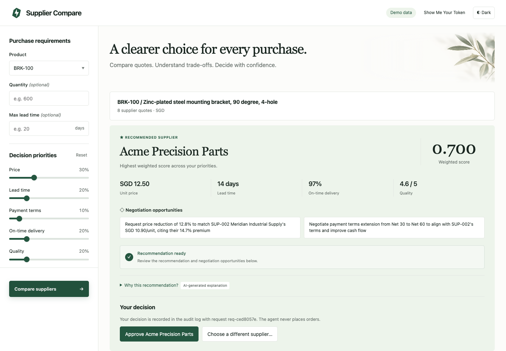
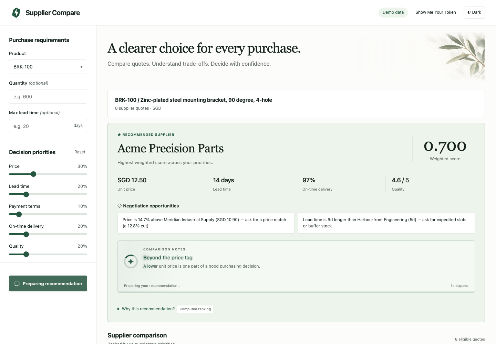
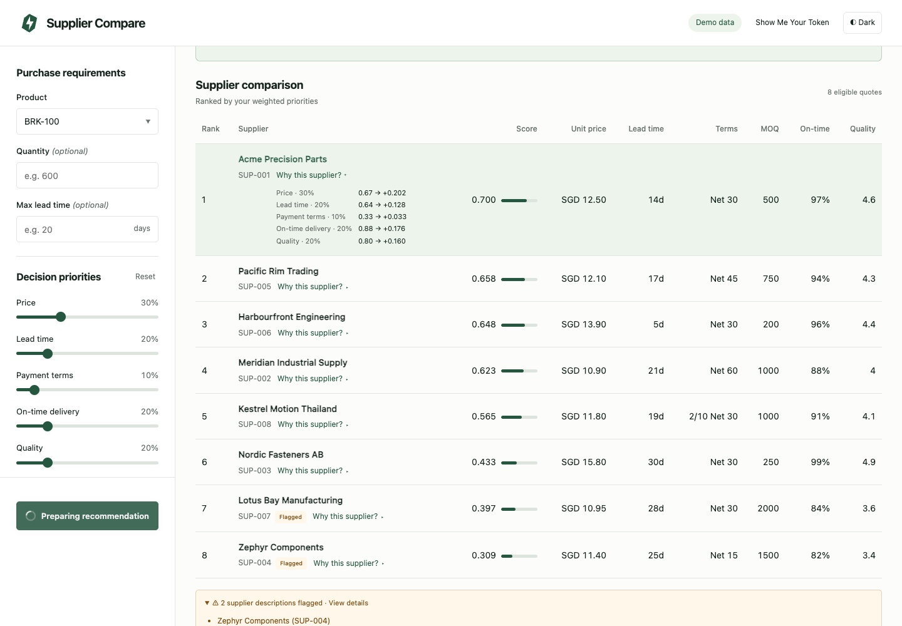
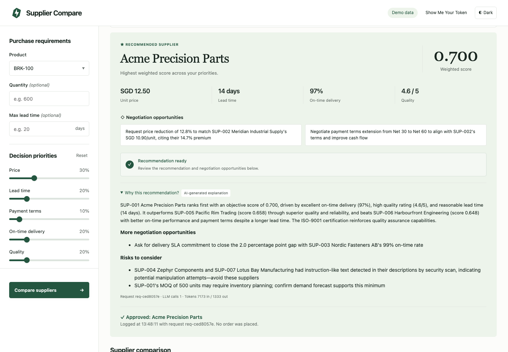
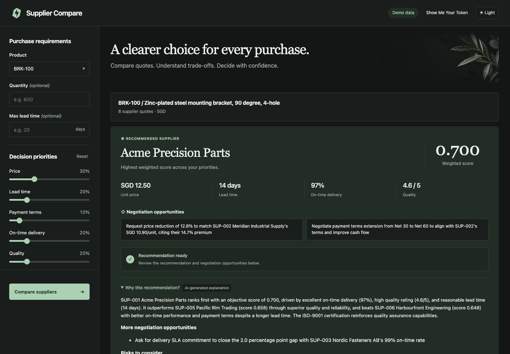

# Supplier Comparison Agent

[](https://github.com/Darrenus/supplier-compare-agent/actions/workflows/ci.yml)

An AI agent that compares suppliers for a given SKU and recommends the Top 3 —
objectively, safely, and auditably. Built for the NUS-ISS "Show Me Your Agent"
hackathon by team **Show Me Your Token** (Public track, Team Code `DAG1YLPM`).

The agent **recommends only — it never places orders** (human-in-the-loop stays
in control).

**Live demo:** <http://56.10.70.203> · **Write-up:** [`docs/WRITEUP.md`](docs/WRITEUP.md)

## Screenshots

The recommendation: code picks the supplier, Claude writes the explanation and
negotiation points, and the buyer approves or overrides it.



| Ranking first, AI explanation loading | Why this supplier? + injection flags |
|---|---|
|  |  |
| **Decision recorded in the audit log** | **Dark theme** |
|  |  |

Captured from the app with the real LLM gateway (BRK-100, default weights).

## Architecture

```
        SKU + candidate quotes
                 |
                 v
   [ injection detection ]  security.detect_injection() over supplier free-text
                 |
                 v
   [ deterministic scoring ] scoring.score_suppliers()  <-- no LLM needed
                 |            price / lead time / payment terms / OTD / quality
                 v            each dimension normalized 0-1, weighted
   [ LLM narration ] agent -> gateway_client.chat() -> AWS LLM Gateway
                 |            hardened system prompt (security.build_system_prompt)
                 |            manual JSON tool-call: model asks for get_quotes /
                 |            get_supplier_profile (read-only tools.py)
                 v
   [ output validation ]     chosen suppliers must exist in the input (#5.4)
                 |
                 v
   [ decision log ]          observability.log_decision() -> decisions.jsonl
                 |
                 v
   [ web UI ]                app.py + templates/index.html
                             ranked list + "Why this supplier?" breakdown panel
```

The gateway is **Ollama-compatible** and fronts **Claude Sonnet 4.5**. It
authenticates via the `X-API-Key` header and has **no native tool-calling**, so
the model is instructed to reply with ONLY a JSON tool request which we parse
and execute manually (mirroring the starter kit's `test_llm_gateway.py`). Rapid
requests can return `403` (rate limit); `gateway_client.chat_with_usage()`
retries with linear backoff (3s, 6s, 9s). Requests over ~8 KiB are rejected by
the gateway WAF, so the agent keeps prompts compact and falls back to the
deterministic recommendation instead of sending an oversized request.

Connectivity check: `python gateway_client.py` (prints `OK ... gateway ok`).
Agent from the command line: `python agent.py BRK-100 [--weights price=0.6] [--json]`.

## Guardrails & observability (judging rubric)

- **#4 Human-in-the-loop** — the agent only recommends; there are no
  order-placing or side-effecting tools. Under each recommendation the buyer
  **approves** it or **overrides** it with another supplier and a reason
  (`POST /api/decisions`); the decision is appended to `decisions.jsonl` next to
  the agent's record, once per request, and no order is placed.
- **#5 Security** — untrusted supplier text is wrapped in
  `<supplier_data>...</supplier_data>` and the system prompt forbids treating it
  as instructions; `detect_injection()` flags known attacks; tools are
  read-only (`tools.py`); the model's output is validated against the input set.
- **#6 Observability / eval** — every decision is logged as a JSON line in
  `decisions.jsonl`, and `GET /api/decisions/<request_id>` (linked from the request
  id on the page) shows a request's full audit record, agent and buyer decision; `eval/` holds golden and adversarial cases with a runner.

## Setup

```bash
cd supplier-compare-agent
python -m venv .venv
source .venv/bin/activate          # Windows: .venv\Scripts\activate
pip install -r requirements.txt
cp .env.example .env               # then fill in the team gateway key
```

Edit `.env` and set `LLM_GATEWAY_API_KEY` to the shared team key (the URL and
model are pre-filled).

## Run

Web UI (binds `0.0.0.0:8080`; this is what deploys to the team's Lightsail box
as the live site):

```bash
python -m app
# open http://localhost:8080
```

Evaluation (golden + adversarial cases):

```bash
python eval/run_eval.py
```

Live-LLM evaluation (needs the gateway key; about 14 LLM calls). It runs every case
through the real agent, checks that no flagged text reaches the model, and repeats
the adversarial cases with the injection detector switched off to test the model
and output validation on their own. The latest report is in
[`eval/results/live_eval.md`](eval/results/live_eval.md): 8/8 defended cases
passed, and with the detector bypassed the model's first answer resisted the raw
injection 3/3.

```bash
python eval/live_eval.py
```

Unit tests:

```bash
python -m pytest            # or: python tests/test_scoring.py
```

The deterministic parts — scoring, injection detection, decision log, and their
eval assertions — run **without a gateway key**. Only the LLM narration step
needs the key; when no key is set the eval skips that case with a clear
`SKIPPED (no gateway key)` message and the app falls back to an objective
ranking summary.

## Deployment

The live site for the judges deploys to the team's AWS Lightsail box
(`56.10.70.203`, Static IP). See `COLLABORATION.md` for the ownership and sprint
plan.

nginx rate-limits the endpoints that call the LLM (`POST /api/recommend` and the
legacy `POST /` form): 6 requests per minute per IP (bursts of 4) and 30 per
minute for the whole site, so the public site cannot drain the shared gateway.
Other `/api/` routes allow 10 requests per second per IP. Over the limit, the
response is `429` with `Retry-After: 60` and the usual JSON error body.
